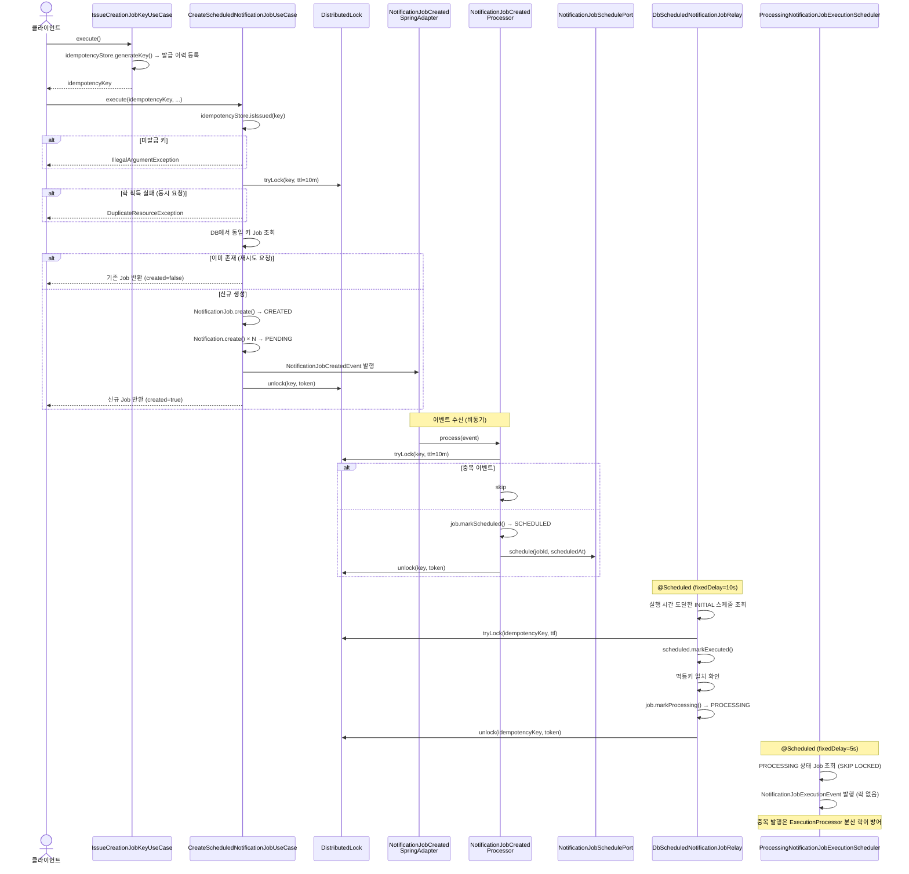

# 알림 잡 생성 및 스케줄링 흐름

## 1. 개요

이 문서는 알림 발송을 위한 알림 잡이 **생성(`CREATED`)** 되어 **스케줄 등록(`SCHEDULED`)** 을 거쳐
**처리 대기(`PROCESSING`)** 상태로 전이되는 흐름을 다룹니다.

```
CREATED → SCHEDULED → PROCESSING
```

---

## 2. 참여 컴포넌트

| 컴포넌트                                          | 위치                      | 역할                                                                       |
|-----------------------------------------------|-------------------------|--------------------------------------------------------------------------|
| `IssueCreationJobKeyUseCase`                  | `application/job`       | 알림 잡 생성 요청 전 멱등성 키 발급                                                    |
| `CreateScheduledNotificationJobUseCase`       | `application/job`       | 알림 잡 (`CREATED`) + 알림 생성 (`PENDING`)                                     |
| `NotificationJobCreatedSpringAdapter`         | `event/listener/spring` | `NotificationJobCreatedEvent` 수신 후 `NotificationJobCreatedProcessor`로 위임 |
| `NotificationJobCreatedProcessor`             | `event/processor`       | 알림 잡 `CREATED → SCHEDULED` 전이 및 알림 잡 트리거를 위한 스케줄 등록                      |
| `DbScheduledNotificationJobRelay`             | `event/relay/db`        | 스케줄 시간 도달 시 알림 잡 `SCHEDULED → PROCESSING` 전이                             |
| `ProcessingNotificationJobExecutionScheduler` | `event/relay`           | 알림 잡 `PROCESSING` 상태 감지 후 실행 이벤트 발행                                      |

---

## 3. 전체 흐름

### 3.1 시퀀스 다이어그램



### 3.2 단계별 상세

**[Step 0] 알림 잡 생성을 위한 멱등성 키 발급 — `IssueCreationJobKeyUseCase`**

```
IssueCreationJobKeyUseCase.execute()
  └─ idempotencyStore.generateKey()   → 고유 키 생성 + 발급 이력 등록
  └─ 반환: idempotencyKey
```

```bash
# Request
curl -X POST http://localhost:8080/api/notification-jobs/key

# Response 200
{
  "data": {
    "idempotencyKey": "nk_01J9Z8K2M3X4Y5Z6W7V8U9T0R1"
  }
}
```

**[Step 1] 알림 잡 생성 — `CreateScheduledNotificationJobUseCase`**

```
CreateScheduledNotificationJobUseCase.execute(idempotencyKey, ...)
  ├─ 1. idempotencyStore.isIssued(key)
  │     └─ 미발급 키: IllegalArgumentException
  ├─ 2. distributedLock.tryLock(key, ttl=10m)
  │     └─ 락 획득 실패: DuplicateResourceException
  ├─ 3. DB에서 동일 키 Job 조회
  │     └─ 이미 존재: 기존 Job 반환 (created=false)
  ├─ 4. templateResolver.resolve(templateCode, channel, locale)
  ├─ 5. NotificationJob.create(...)              → Job: CREATED
  ├─ 6. Notification.create(...) × N명           → Notification: PENDING
  ├─ 7. DB 저장 (job + notifications)
  ├─ 8. NotificationJobCreatedEvent 발행
  └─ 9. distributedLock.unlock(key, token)       (finally)
```

```bash
# Request
curl -X POST http://localhost:8080/api/notification-jobs \
  -H "Content-Type: application/json" \
  -d '{
    "idempotencyKey": "nk_01J9Z8K2M3X4Y5Z6W7V8U9T0R1",
    "channel": "EMAIL",
    "templateCode": "welcome-email",
    "locale": "ko",
    "type": "MARKETING",
    "metadata": { "campaignId": "camp_001" },
    "scheduledAt": "2025-01-01T09:00:00+09:00",
    "recipients": [
      {
        "recipientId": 1001,
        "contact": "user@example.com",
        "variables": { "name": "홍길동" }
      }
    ]
  }'

# Response 201 (신규 생성)
{
  "data": {
    "jobId": "123456789012345678",
    "channel": "EMAIL",
    "status": "CREATED",
    "type": "MARKETING",
    "metadata": { "campaignId": "camp_001" },
    "scheduleHistory": [
      { "type": "INITIAL", "scheduledAt": "2025-01-01T09:00:00+09:00", "executed": false }
    ],
    "totalCount": 1,
    "pendingCount": 1,
    "sendingCount": 0,
    "sentCount": 0,
    "failedCount": 0,
    "retryWaitingCount": 0,
    "deadLetterCount": 0,
    "cancelledCount": 0,
    "createdAt": "2024-12-31T19:00:00+09:00",
    "lastStatusChangeReason": null
  }
}

# Response 200 (중복 요청 — 기존 Job 반환)
```

**[Step 2] 스케줄 등록 과정에서 알림 잡 `SCHEDULED` 전이 — `NotificationJobCreatedSpringAdapter` + `NotificationJobCreatedProcessor`**

```
NotificationJobCreatedSpringAdapter.handle(NotificationJobCreatedEvent)
  └─ NotificationJobCreatedProcessor.process(event)
        ├─ 0. distributedLock.tryLock(key, ttl=10m)
        │     └─ 락 획득 실패: 중복 이벤트 skip
        ├─ 1. job 로드 + idempotencyKey 일치 확인
        │     └─ 불일치: skip (키 변경된 경우)
        ├─ 2. job.markScheduled()                → Job: CREATED → SCHEDULED
        ├─ 3. schedulePort.schedule(jobId, scheduledAt)
        ├─ 4. historyRecorder.execute(CREATED, SCHEDULED, ...)
        └─ 5. distributedLock.unlock(key, token) (finally)
```

**[Step 3] 스케줄 서비스의 릴레이를 통한 알림 잡 `PROCESSING` 전이 — `DbScheduledNotificationJobRelay`**

```
DbScheduledNotificationJobRelay.relay()  ← @Scheduled(fixedDelay=10s)
  ├─ 1. 실행 시간 도달한 INITIAL 타입 스케줄 조회 (batch)
  └─ 2. 건별 processScheduledJob():
        ├─ findByIdAndDeletedFalse(jobId)        → 멱등키 획득
        ├─ distributedLock.tryLock(key, ttl)      → 락 획득 실패 시 skip
        ├─ scheduled.markExecuted()              → executed=true
        ├─ job = findByIdAndDeletedFalseForUpdate(jobId)
        ├─ 멱등키 일치 확인
        ├─ job.markProcessing()                  → Job: SCHEDULED → PROCESSING
        ├─ NotificationJobStatusChangedEvent 발행
        └─ distributedLock.unlock(key, token)     (finally)
```

**[Step 4] `PROCESSING` 상태의 알림 잡을 처리하기 위한 실행 이벤트 발행 — `ProcessingNotificationJobExecutionScheduler`**

```
ProcessingNotificationJobExecutionScheduler.schedule()  ← @Scheduled(fixedDelay=5s)
  ├─ 1. PROCESSING 상태 Job 조회 (SELECT FOR UPDATE SKIP LOCKED, batch)
  │     → 다중 인스턴스가 동시에 폴링해도 인스턴스별로 서로 다른 Job 조회
  └─ 2. 건별 NotificationJobExecutionEvent 발행
```

> **SKIP LOCKED와 Processor 락 충돌 없음**
> `SKIP LOCKED` 잠금은 스케줄러 트랜잭션 범위에서만 유지됩니다.
> `NotificationJobExecutionSpringAdapter`는 `@ApplicationModuleListener`(AFTER_COMMIT + Async)로 동작하므로
> 스케줄러 트랜잭션이 커밋된 이후 별도 스레드에서 `NotificationJobExecutionProcessor`를 호출합니다.
> `NotificationJobExecutionProcessor`가 `findByIdAndDeletedFalseForUpdate`를 실행하는 시점에는 SKIP LOCKED 잠금이 이미 해제된 상태입니다.

---

## 4. 설계 의도

### 4.1 2단계 키 발급 패턴

알림 잡 생성은 `IssueCreationJobKeyUseCase → CreateScheduledNotificationJobUseCase` 2단계로 이루어집니다.

키를 서버가 직접 발급하는 이유는, 클라이언트가 임의 키를 사용하는 것을 방지하기 위해서입니다.
클라이언트가 직접 키를 구성하면 충돌 가능성이 있고, 동일 키에 대한 중복 방지 보장을 서버에서 제어할 수 없습니다.
서버 발급 키는 `idempotencyStore.isIssued()` 검증을 통과해야만 생성 요청이 수락되므로,
네트워크 재시도나 클라이언트 중복 호출 상황에서도 동일 요청이 중복 처리되지 않습니다.

### 4.2 릴레이 레이어 격리

`NotificationJobCreatedProcessor`가 스케줄을 등록하는 외부 스케줄링 서비스는
콜백(push) 방식을 지원할 수도, 지원하지 않을 수도 있습니다.
외부 서비스의 알림 방식에 서비스 코드가 직접 의존하면, 외부 서비스가 변경될 때 서비스 코드도 함께 변경되어야 합니다.

릴레이 레이어(`event/relay`)는 이 의존을 격리합니다.
외부 서비스가 어떤 방식으로 알림을 제공하든, 릴레이의 역할은 하나입니다:
**스케줄 시간이 되었을 때 상태 전이**.

현재 구현은 DB 폴링 방식입니다. DB에 저장된 스케줄 정보를 주기적으로 조회하여 실행 시간이 도달한 알림 잡을 감지합니다.
외부 스케줄링 서비스가 콜백을 지원한다면 콜백을 수신하는 릴레이 구현으로 교체할 수 있으며,
서비스의 나머지 코드는 변경할 필요가 없습니다.

**현재 릴레이 구현체**

| 구현체                                        | 전이                       | 대상 스케줄 타입 |
|--------------------------------------------|--------------------------|-----------|
| `DbScheduledNotificationJobRelay`          | `SCHEDULED → PROCESSING` | `INITIAL` |
| `DbRetryScheduledNotificationRecoverRelay` | `FAILED → RETRYING`      | `RETRY`   |

### 4.3 실행 트리거와 상태 전이의 분리

`PROCESSING`인 상태의 알림 잡에 진입하는 경로는 스케줄 릴레이 외에도 재시도 스케줄러, Stuck 복구 등 다양합니다.
상태 전이와 실행 이벤트 발행을 별도 컴포넌트로 분리함으로써, 진입 경로에 무관하게 `PROCESSING` 상태의 알림 잡을 단일 컴포넌트가 일관된 방식으로 실행합니다.

**현재 스케줄러 구현체**

| 구현체                                           | 역할                                     |
|-----------------------------------------------|----------------------------------------|
| `ProcessingNotificationJobExecutionScheduler` | `PROCESSING` Job 감지 → 실행 이벤트 발행        |
| `RetryingNotificationJobExecutionScheduler`   | `RETRYING → PROCESSING` 전이 → 실행 이벤트 발행 |

---

## 5. 중복 방지 전략

### 5.1 생성 단계

| 방어 지점    | 메커니즘                                    | 대응 상황               |
|----------|-----------------------------------------|---------------------|
| 키 발급 검증  | `idempotencyStore.isIssued(key)`        | 클라이언트가 임의 키 사용 시 차단 |
| 동시 생성 차단 | `distributedLock.tryLock(key, ttl=10m)` | 동시 중복 요청            |
| 재시도 응답   | DB에서 동일 키 Job 조회 후 기존 반환                | 네트워크 재시도 등 순차 중복 요청 |

### 5.2 이벤트 처리 단계

| 방어 지점           | 메커니즘                                    | 대응 상황     |
|-----------------|-----------------------------------------|-----------|
| Processor 중복 처리 | `distributedLock.tryLock(key, ttl=10m)` | 이벤트 중복 수신 |

### 5.3 릴레이 실행 단계

| 방어 지점         | 메커니즘                                              | 대응 상황        |
|---------------|---------------------------------------------------|--------------|
| 알림 잡 동시 접근 차단 | `distributedLock.tryLock` + `SELECT FOR UPDATE` | 스케줄 중복 수신/폴링 |

### 5.4 스케줄러 실행 단계

| 방어 지점             | 메커니즘                            | 대응 상황     |
|-------------------|---------------------------------|-----------|
| 알림 잡 중복 이벤트 발행 방지 | `SELECT FOR UPDATE SKIP LOCKED` | 이벤트 중복 수신 |
