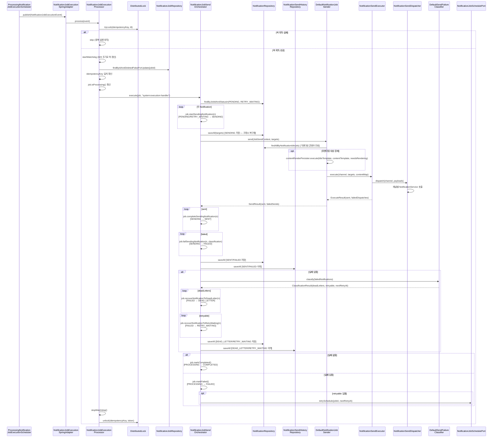

# 알림 잡 처리 및 완료 흐름

## 1. 개요

이 문서는 `PROCESSING` 상태의 알림 잡이 실제 발송을 수행하고 최종 상태(`COMPLETED`/`FAILED`)로 전이되는 흐름을 다룹니다.

```
PROCESSING → COMPLETED   (전체 성공)
PROCESSING → FAILED      (일부 또는 전체 실패, retryable 있으면 재시도 스케줄 등록)
```

---

## 2. 참여 컴포넌트

| 컴포넌트                                    | 위치                      | 역할                                                                                                                      |
|-----------------------------------------|-------------------------|-------------------------------------------------------------------------------------------------------------------------|
| `NotificationJobExecutionSpringAdapter` | `event/listener/spring` | `NotificationJobExecutionEvent` 수신 후 `NotificationJobExecutionProcessor`로 위임                                            |
| `NotificationJobExecutionProcessor`     | `event/processor`       | 잡 `PROCESSING` 상태 검증 및 분산 락·멱등성 키 확인 후 Orchestrator 호출                                                                  |
| `NotificationJobSendOrchestrator`       | `service/job`           | 알림 `PENDING/RETRY_WAITING → SENDING → SENT/FAILED → DEAD_LETTER/RETRY_WAITING`, 잡 `PROCESSING → COMPLETED/FAILED` 전이 조율 |
| `JobStatusHistoryRecorder`              | `service/job`           | 알림 잡 상태 전이(`PROCESSING → COMPLETED/FAILED`) 이력 기록                                                                       |
| `NotificationJobSender`                 | `service/job`           | 콘텐츠 준비(렌더링 또는 재사용) + 채널 발송 위임, 상태 전이 없음                                                                                 |
| `NotificationSendExecutor`              | `service/sender`        | 채널 발송 실행 및 결과 반환, 상태 전이 없음                                                                                              |
| `NotificationSendDispatcher`            | `service/sender`        | 채널별 `NotificationService` 선택 및 호출                                                                                       |
| `SendFailureClassifier`                 | `service/job`           | 실패 알림을 `DEAD_LETTER`/`RETRY_WAITING` 대상으로 분류 결과 반환, 상태 전이 없음                                                            |

---

## 3. 전체 흐름

### 시퀀스 다이어그램



### 단계별 설명

**[Step 1] 실행 이벤트 수신 - `NotificationJobExecutionSpringAdapter` + `NotificationJobExecutionProcessor`**

`NotificationJobExecutionSpringAdapter`는 `ProcessingNotificationJobExecutionScheduler`가 발행한
`NotificationJobExecutionEvent`를 수신하고, `NotificationJobExecutionProcessor`에 처리를 위임합니다.
`NotificationJobExecutionProcessor`는 분산 락, 멱등성 키, Job 상태를 검증한 뒤 Orchestrator를 호출합니다.

**[Step 2] 발송 대상 조회 및 `Orchestrator`를 활용한 알림 전송**

`NotificationJobSendOrchestrator`는 해당 알림 잡에 속한 `PENDING` 또는 `RETRY_WAITING` 상태의 알림을 발송 대상으로 조회합니다.

- **최초 실행**: `PENDING` 상태 알림이 대상
- **재시도 실행**: `RETRY_WAITING` 상태 알림이 대상 (이전 실패에서 복구된 것)

조회 후 즉시 모든 알림의 상태를 `SENDING`으로 전이하고 저장합니다.

**[Step 3] 콘텐츠 준비 및 발송 실행 - `Sender + Executor`**

`NotificationJobSender`는 채널·템플릿 정보를 담은 `JobSendContext`를 받아 콘텐츠를 준비합니다.

- 이미 렌더링된 콘텐츠가 있으면 DB에서 조회하여 재사용
- 없으면 `titleTemplate`·`contentTemplate`에 변수를 적용하여 렌더링 후 저장

`NotificationSendExecutor`는 채널·알림·콘텐츠만 받아 발송을 실행하고 결과(`sent`, `failedDispatches`)를
반환합니다.

**[Step 4] 알림 발송 결과 반영 - `Orchestrator`**

`Orchestrator`는 `Sender`로부터 받은 `SendResult`를 기반으로 상태 전이와 저장을 직접 수행합니다.

- 성공 → `job.completeSendingNotification(n)` → `SENDING → SENT`
- 실패 → `job.failSendingNotification(n, classification, reason)` → `SENDING → FAILED`

**[Step 5] 실패 분류 및 반영 (`Classifier` + `Orchestrator`, 실패 있을 때만)**

`SendFailureClassifier`는 `FAILED` 상태 알림을 분류합니다.

| 분류            | 조건                                                  | Orchestrator가 수행하는 전이    |
|---------------|-----------------------------------------------------|--------------------------|
| `deadLetters` | `PERMANENT` 분류 또는 `sendTryCount >= maxSendTryCount` | `FAILED → DEAD_LETTER`   |
| `retryable`   | `TRANSIENT` 분류이고 `sendTryCount < maxSendTryCount`   | `FAILED → RETRY_WAITING` |

실패 알림이 존재하여 알림 잡을 재시도 해야하는 경우 재시도 스케줄 시각(`nextRetryAt`)은 `retryable` 중 `sendTryCount` 최대값을 기준으로 계산됩니다:

```
nextRetryAt = now + min(baseDelay × 2^(maxSendTryCount - 1), maxDelay)
```

`sendTryCount` 최대값은 "이 알림 잡이 이 알림을 몇 번 처리 시도했는지"의 대리 지표로,
실패 횟수가 많을수록 더 긴 대기 후 재시도합니다.

**[Step 6] 알림 잡 최종 상태 결정 - `Orchestrator`**

`Orchestrator`는 발송 결과에 따라 알림 잡의 최종 상태를 결정합니다.

| 조건                   | Job 상태 전이                          |
|----------------------|------------------------------------|
| 실패 없음                | `PROCESSING → COMPLETED`           |
| 실패 있음 (deadLetter만)  | `PROCESSING → FAILED`              |
| 실패 있음 (retryable 포함) | `PROCESSING → FAILED` + 재시도 스케줄 등록 |

`retryable`이 있는 경우 재시도 스케줄이 등록되며, 이후 `RETRYING → PROCESSING` 전이를 거쳐 동일 파이프라인이 재실행됩니다.

---

## 4. 설계 의도

### 4.1 NotificationJob을 통한 Notification 상태 전이

모든 알림 상태 전이는 `NotificationJob`의 메서드를 통해 수행됩니다.

```java
job.startSendingNotification(n);          // PENDING/RETRY_WAITING → SENDING

job.completeSendingNotification(n);       // SENDING → SENT

job.failSendingNotification(n, ...);      // SENDING → FAILED

job.recoverNotificationToDeadLetter(n);   // FAILED → DEAD_LETTER

job.recoverNotificationToRetryWaiting(n); // FAILED → RETRY_WAITING
```

알림 잡이 중간자 역할을 하는 이유는 `JobNotificationPolicy`로 상태 전이를 검증하기 위해서입니다.
현재 알림 잡 상태에서 허용되지 않는 알림의 전이를 시도하면 예외가 발생합니다.
이를 통해 잘못된 순서의 상태 전이가 DB에 반영되는 것을 도메인 수준에서 방지합니다.

### 4.2 Watchdog을 통한 분산 락 유지

발송 파이프라인은 외부 채널 호출을 포함하므로 수신자 수에 따라 처리 시간이 길어질 수 있습니다.
처리 중 분산 락 TTL이 만료되면 다른 인스턴스가 동일 알림 잡을 처리하게 됩니다.

Watchdog은 `TTL / 3` 주기로 락을 갱신하여 발송이 완료될 때까지 락을 유지합니다.
발송이 완료되면 Watchdog을 중지하고 즉시 락을 해제합니다.

### 4.3 파이프라인 조율과 구현의 분리 (`NotificationJobSendOrchestrator`)

`NotificationJobSendOrchestrator`는 발송 파이프라인의 **흐름(무엇을)**을 조율하지만, 각 단계의 **구현(어떻게)**에는 관여하지 않습니다.
발송 대상 조회 → 발송 실행(`NotificationJobSender`) → 실패 분류(`SendFailureClassifier`) → Job 최종 상태 결정의 순서를 유지하며, 각 단계를 해당 컴포넌트에
위임합니다.

`NotificationJob`에 대한 모든 상태 전이, 저장, 이력 기록은 `Orchestrator` 한 곳에서만 수행됩니다.
`NotificationJobSender`와 `SendFailureClassifier`는 인터페이스로 분리되어 있으며,
발송 방식이나 실패 분류 정책이 바뀌더라도 Orchestrator의 흐름 코드는 변경이 필요 없습니다.

### 4.4 채널별 발송 전략 분리 (`NotificationSendDispatcher`)

`NotificationSendDispatcher`는 채널에 맞는 `NotificationService` 구현체를 선택하여 발송을 위임합니다.
`NotificationService` 구현체는 애플리케이션 시작 시 채널 기준으로 맵에 등록되며, `Dispatcher`는 채널을 키로 구현체를 조회합니다.

새로운 채널을 추가할 때는 `NotificationService`를 구현하는 것만으로 충분하며,
`Dispatcher`나 상위 코드(`NotificationSendExecutor`)를 변경할 필요가 없습니다.
