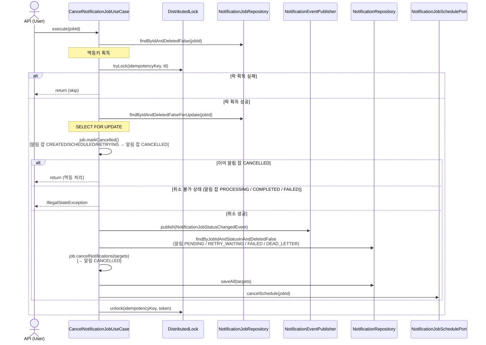
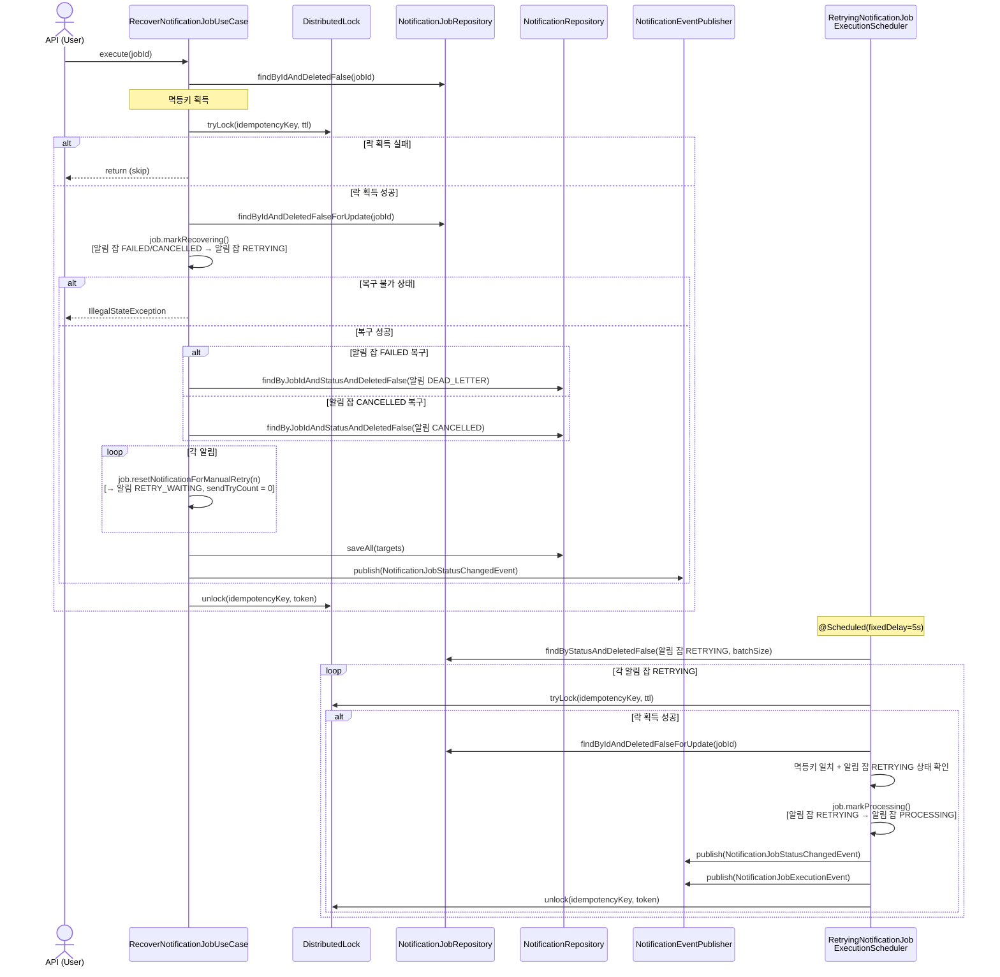
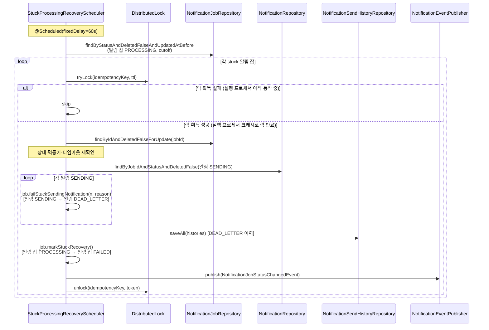

# 알림 잡 취소 및 복구 흐름

## 1. 개요

이 문서는 알림 잡이 **취소(`CANCELLED`)** 되는 경로와, 취소·실패된 알림 잡을 **수동 복구(`RETRYING`)** 하는 흐름을 다룹니다.
또한 발송 도중 중단된 알림 잡을 자동으로 복구하는 `StuckProcessingRecoveryScheduler`의 동작도 함께 설명합니다.

```
알림 잡 취소
  알림 잡 CREATED / SCHEDULED / RETRYING → 알림 잡 CANCELLED

알림 잡 수동 복구
  알림 잡 FAILED / CANCELLED → 알림 잡 RETRYING → 알림 잡 PROCESSING

스턱 PROCESSING 자동 복구
  알림 잡 PROCESSING (타임아웃) → 알림 잡 FAILED
  알림 SENDING → 알림 DEAD_LETTER
```

> **알림 잡 `PROCESSING`, `COMPLETED`는 취소 불가.** `PROCESSING`은 `NotificationJobExecutionProcessor`가 분산 락을 보유하고 있어 취소할 수 없으며,
`COMPLETED`는 terminal 상태입니다.
`FAILED`는 취소 대상이 아닌 복구 대상입니다.

---

## 2. 참여 컴포넌트

| 컴포넌트                                        | 위치                      | 역할                                                                                                           |
|---------------------------------------------|-------------------------|--------------------------------------------------------------------------------------------------------------|
| `CancelNotificationJobUseCase`              | `application/job`       | 알림 잡 `CREATED/SCHEDULED/RETRYING → CANCELLED` + 알림 `PENDING/RETRY_WAITING/FAILED/DEAD_LETTER → CANCELLED` 전이 |
| `RecoverNotificationJobUseCase`             | `application/job`       | 알림 잡 `FAILED/CANCELLED → RETRYING` 전이 + 알림 `DEAD_LETTER/CANCELLED → RETRY_WAITING` 리셋을 단일 트랜잭션에서 처리          |
| `NotificationJobStatusChangedSpringAdapter` | `event/listener/spring` | `NotificationJobStatusChangedEvent` 수신 후 `NotificationJobStatusChangedProcessor`로 위임                         |
| `NotificationJobStatusChangedProcessor`     | `event/processor`       | 알림 잡 상태 변경 이벤트를 받아 `JobStatusHistoryRecorder`로 이력 기록, 상태 전이 없음                                               |
| `RetryingNotificationJobExecutionScheduler` | `event/relay`           | 알림 잡 `RETRYING → PROCESSING` 전이 및 실행 이벤트 발행                                                                  |
| `StuckProcessingRecoveryScheduler`          | `event/relay`           | 장시간 알림 잡 `PROCESSING` 감지 — 알림 `SENDING → DEAD_LETTER`, 알림 잡 `PROCESSING → FAILED` 전이                         |

---

## 3. 취소 흐름

### 시퀀스 다이어그램



### 단계별 설명

**[Step 1] 알림 잡 취소 — `CancelNotificationJobUseCase`**

분산 락과 멱등성 검증으로 동시 취소 요청을 차단합니다.
`CREATED`, `SCHEDULED`, `RETRYING` 상태의 알림 잡만 `CANCELLED`로 전이되며, 이미 `CANCELLED`인 경우는 멱등하게 처리됩니다.

```bash
# Request
curl -X DELETE http://localhost:8080/api/notification-jobs/123456789012345678

# Response 204 No Content
```

| 현재 알림 잡 상태        | 취소 결과            |
|-------------------|------------------|
| 알림 잡 `CREATED`    | 알림 잡 `CANCELLED` |
| 알림 잡 `SCHEDULED`  | 알림 잡 `CANCELLED` |
| 알림 잡 `RETRYING`   | 알림 잡 `CANCELLED` |
| 알림 잡 `PROCESSING` | **불가**           |
| 알림 잡 `COMPLETED`  | **불가**           |
| 알림 잡 `FAILED`     | **불가**           |
| 알림 잡 `CANCELLED`  | return (멱등 처리)   |

**[Step 2] 알림 취소 — `CancelNotificationJobUseCase`**

취소 가능한 상태의 알림을 일괄 조회하여 `CANCELLED`로 전이합니다.

| 현재 알림 상태         | 취소 후 알림 상태   |
|------------------|--------------|
| 알림 PENDING       | 알림 CANCELLED |
| 알림 RETRY_WAITING | 알림 CANCELLED |
| 알림 FAILED        | 알림 CANCELLED |
| 알림 DEAD_LETTER   | 알림 CANCELLED |

> `SENDING` 상태 알림은 이미 외부 채널에 발송 요청이 나간 상태이므로 취소 대상에서 제외됩니다.

**[Step 3] 스케줄 해제 — `CancelNotificationJobUseCase`**

`schedulePort.cancelSchedule(jobId)`로 등록된 예약 또는 재시도 스케줄을 해제합니다.

---

## 4. 복구 흐름

알림 잡 `FAILED` 또는 알림 잡 `CANCELLED` 상태의 알림 잡을 사용자가 수동으로 복구할 수 있습니다.

### 시퀀스 다이어그램



### 단계별 설명

**[Step 1] 알림 잡 복구 및 알림 리셋 — `RecoverNotificationJobUseCase`**

```
RecoverNotificationJobUseCase.execute(jobId)
  ├─ 1. findByIdAndDeletedFalse(jobId)          → 멱등키 획득
  ├─ 2. distributedLock.tryLock(key, ttl)
  │     └─ 락 획득 실패: return (skip)
  ├─ 3. findByIdAndDeletedFalseForUpdate(jobId)  → SELECT FOR UPDATE
  ├─ 4. job.markRecovering()                     → 알림 잡 FAILED/CANCELLED → 알림 잡 RETRYING
  │     └─ 그 외 상태: IllegalStateException
  ├─ 5. 복구 진입 상태에 따라 대상 알림 조회 및 RETRY_WAITING 전이 (같은 트랜잭션)
  │     ├─ 알림 잡 FAILED 복구   → 알림 DEAD_LETTER → 알림 RETRY_WAITING
  │     └─ 알림 잡 CANCELLED 복구 → 알림 CANCELLED   → 알림 RETRY_WAITING (sendTryCount = 0)
  └─ 6. publish(NotificationJobStatusChangedEvent) → 이력 기록 트리거
```

알림 잡 전이와 알림 리셋이 단일 트랜잭션에서 원자적으로 커밋됩니다. 트랜잭션 커밋 이전에
`RetryingNotificationJobExecutionScheduler`가 RETRYING 잡을 선점하더라도, 알림은 이미 같은
트랜잭션에서 RETRY_WAITING으로 리셋되어 있으므로 발송 대상 누락이 발생하지 않습니다.

```bash
# Request
curl -X POST http://localhost:8080/api/notification-jobs/123456789012345678/recover

# Response 200 OK
```

| 알림 잡 복구 진입 상태     | 조회 대상 알림 상태    | 알림 전이                             |
|-------------------|----------------|-----------------------------------|
| 알림 잡 FAILED 복구    | 알림 DEAD_LETTER | 알림 DEAD_LETTER → 알림 RETRY_WAITING |
| 알림 잡 CANCELLED 복구 | 알림 CANCELLED   | 알림 CANCELLED → 알림 RETRY_WAITING   |

**[Step 2] 알림 잡 PROCESSING 전이 및 실행 이벤트 발행 — `RetryingNotificationJobExecutionScheduler`**

```
RetryingNotificationJobExecutionScheduler.relay()  ← @Scheduled(fixedDelay=5s)
  ├─ 1. 알림 잡 RETRYING 일괄 조회 (batchSize)
  └─ 2. 건별 transitionAndPublish():
        ├─ distributedLock.tryLock(key, ttl)      → 락 획득 실패 시 skip
        ├─ findByIdAndDeletedFalseForUpdate(jobId)
        ├─ 멱등키 일치 + 알림 잡 RETRYING 상태 확인
        ├─ job.markProcessing()                   → 알림 잡 RETRYING → 알림 잡 PROCESSING
        ├─ publish(NotificationJobStatusChangedEvent)
        └─ publish(NotificationJobExecutionEvent) → 발송 파이프라인 진입
```

이후 `NotificationJobExecutionSpringAdapter`가 `NotificationJobExecutionEvent`를 수신하고,
`NotificationJobExecutionProcessor`가 정상 발송 파이프라인(doc 02)과 동일하게 처리합니다.

---

## 5. 스턱 PROCESSING 복구 흐름

실행 중인 `NotificationJobExecutionProcessor`가 크래시되면 Watchdog도 함께 중단되어 분산 락이 TTL 만료로 해제됩니다.
이때 알림 `SENDING` 상태가 DB에 잔류할 수 있으며, `StuckProcessingRecoveryScheduler`가 이를 감지하여
알림 `SENDING`을 알림 `DEAD_LETTER`로 전이하고 알림 잡을 알림 잡 `FAILED`로 전이합니다.

### 시퀀스 다이어그램



### 동작 범위

| 대상   | 전이                                               | 이력                                             |
|------|--------------------------------------------------|------------------------------------------------|
| 알림   | 알림 `SENDING → DEAD_LETTER` (`STUCK_RECOVERY` 정책) | `NotificationSendHistory` 기록                   |
| 알림 잡 | 알림 잡 `PROCESSING → FAILED` (`STUCK_RECOVERY` 정책) | `NotificationJobStatusChangedEvent` 발행으로 이력 기록 |

알림 잡 `FAILED` 전이 이후 `RecoverNotificationJobUseCase`를 통한 수동 복구(`FAILED → RETRYING`)가 가능합니다.
`RecoverNotificationJobUseCase`가 알림 잡 전이와 동시에 알림 `DEAD_LETTER`를 `RETRY_WAITING`으로 초기화하므로 재발송 경로가 완성됩니다.

---

## 6. 설계 의도

### 6.1 취소·복구 가능 상태와 `JobNotificationPolicy`

취소와 복구에서 허용되는 알림 잡·알림 상태 전이는 `JobNotificationPolicy`에 선언됩니다.

**취소 — `TO_CANCELLED` 정책**

알림 잡의 취소 가능 출발 상태(`fromStatuses`)는 `CREATED`, `SCHEDULED`, `RETRYING`으로 제한됩니다.
`PROCESSING`은 여기에 포함되지 않으므로 발송이 시작된 알림 잡은 취소가 원천 차단됩니다.
`COMPLETED`는 terminal 상태, `FAILED`는 취소가 아닌 복구 대상입니다.

개별 알림의 취소 대상(`notificationTransitions`)은 `PENDING`, `RETRY_WAITING`, `FAILED`, `DEAD_LETTER`입니다.
`SENDING`은 이 목록에 포함되지 않습니다.
발송 요청이 이미 외부 채널로 나간 상태에서 결과가 확정되기 전에 상태를 변경하면
발송 결과 반영 흐름과 충돌하기 때문입니다.

**복구 — `TO_RETRYING` 정책**

`TO_RETRYING` 정책의 `notificationTransitions`와 동일하게, 복구 가능한 알림 상태는 `DEAD_LETTER`와 `CANCELLED`뿐입니다.
`SENDING`은 여기에도 포함되지 않습니다.

`SENDING` 알림은 `STUCK_RECOVERY` 정책이 `DEAD_LETTER`로 전이한 뒤에야 `TO_RETRYING`의 복구 대상이 됩니다.
`STUCK_RECOVERY` 정책이 취소·복구 흐름으로 처리할 수 없는 `SENDING` 상태를 처리 가능한 상태로 전환하는 가교 역할을 합니다.

### 6.2 수동 복구와 자동 재시도의 `sendTryCount` 처리 차이

자동 재시도는 `sendTryCount`를 누적하여 지수 백오프와 최대 재시도 횟수를 계산합니다.
반복 실패 시 알림이 `DEAD_LETTER`로 전이되는 것도 이 카운트 기반입니다.

수동 복구는 운영자가 상황을 인지하고 의도적으로 재시도를 결정한 행위입니다.
과거 실패 횟수와 무관하게 처음부터 재시도 기회를 다시 부여하기 위해 `sendTryCount`를 `0`으로 초기화합니다.
과거 이력은 `NotificationSendHistory`에 보존되어 있어 추적은 가능합니다.
